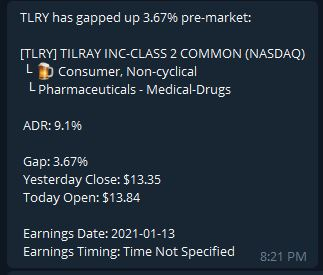
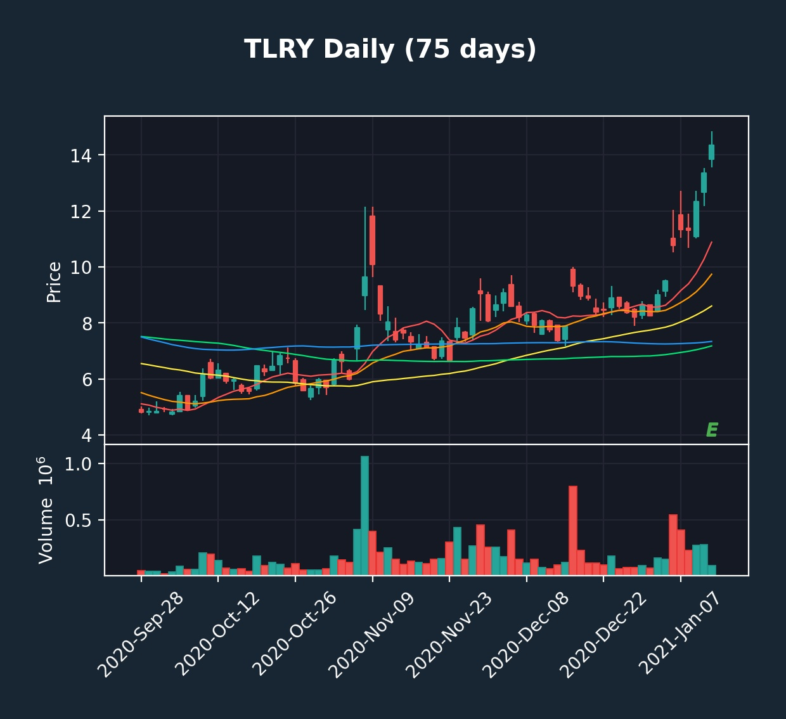

<br />
<p align="center">
  
  <a href="https://github.com/mpainenz/octopus">
    
  </a>
  
  <h3 align="center">Octopus Trading Bot</h3>

  <p align="center">
    Algorithmic Swing Trading, Scanning, and Backtesting. 
    </br>
    Written in Python, for use with the Interactive Brokers TWS API.
</p>


<!-- ABOUT THE PROJECT -->
## About The Project

<!-- [![Product Name Screen Shot][product-screenshot]](https://example.com) -->

This project is an algorithmic trading framework, built for swing trading stocks which have recently reported earnings.

Inspired by the trading methods of Kristjan Kullamägi, found at any of the following locations

Twitter: [@Qullamaggie](https://twitter.com/Qullamaggie)
Twitch: [https://www.twitch.tv/qullamaggie](twitch.tv/qullamaggie)
Website: [https://qullamaggie.com/](qullamaggie.com)


This Bot is inteded to provide an algorithmic trading framework compatable with some of the strategies taught by Kris.

Kris has shared his very successful trading methods on [https://www.twitch.tv/qullamaggie](twitch.tv/qullamaggie), and has gathered a large following. If you want to learn about Swing trading, his <a href="https://qullamaggie.com/">website</a> is a good starting point.

This bot is under development, and you can find me (Mark) on the [https://discord.gg/fFyMrapwfd](qullamaggie Discord server), or on Twitter: [@Kynuren](https://twitter.com/Kynuren). The bot is not yet ready to make automated trades, but has matured enough to be useful in other ways.

The general concept, is that this bot constantly run, and monitor any stock as they report earnings. Using a customizable strategy, the bot and will look for buy and sell signals, based on technical anaylsis. A user of this Bot can take their strategy, and Back Test it against the historical chart and Earnings calendar data. In that way, adjusting parameters such as Average Daily Range, Daily Volume, or other criteria, a person should be able to scan a wider range of stocks than might be possible manually. Another use, is this Bot can help to scan identify stocks that a Swing trader may be interested in.

The bot allows for different strategies to be back-tested against, and also to scan for the best past earners in order to identify what stocks were the best historic performers for research purposes.

The bot is setup to connect to Discord, and/or Telegram, and will send real-time updates as stocks are bought, or sold (Or purely in an informative way). In addition, it can identify when stocks have broken out, or simply provide a chart on request from your Phone. 

The project uses:
* Python 3.9+
* Interactive Brokers TWS
* SQLLite database to cache historic OHLCV data and Earnings Calendar data
* Discord and Telegram Bot to receieve notifications and interact with the bot


### Built With

* [ib_insync](https://github.com/erdewit/ib_insync) - Interactive Brokers TWS Client
* [pandas](https://pandas.pydata.org/) - Data Analytics
* [pandas-ta](https://github.com/twopirllc/pandas-ta) - Technical Analysis
* [sqlalchemy](https://www.sqlalchemy.org/) - SQL Database ORM
* [aiogram](https://docs.aiogram.dev/en/latest/) - Telegram Bot
* [discord.py](https://discordpy.readthedocs.io/en/stable/) - Discord Bot
* [matplotlib](https://github.com/matplotlib) - Chart Plotting
* [mplfinance](https://github.com/matplotlib/mplfinance) - General Plotting
* [yahoo_fin](https://github.com/atreadw1492/yahoo_fin) - Yahoo Finance


<summary><h2 style="display: inline-block">Table of Contents</h2></summary>
<ol>
<li>
    <a href="#basic-started">Getting Started</a>
    <ul>
    <li><a href="#prerequisites">Prerequisites</a></li>
    <li><a href="#installation">Installation</a></li>
    </ul>
</li>
<li><a href="#basic-scan">Basic Scanning and Backtesting</a></li>
<li><a href="#roadmap">Roadmap</a></li>
<li><a href="#contributing">Contributing</a></li>
<li><a href="#license">License</a></li>
<li><a href="#contact">Contact</a></li>
<li><a href="#acknowledgements">Acknowledgements</a></li>
</ol>

<!-- GETTING STARTED -->
## Getting Started

To get a local copy up and running follow these simple steps.

### Prerequisites

You must have an active Interactive Brokers account, and run the Trader Workstation, or IB Gateway applications on your machine. This Bot needs to use the API functionality exposed by one of those programs, and you must hold a current Interactive Brokers account.

Follow the instructions here to [Enable the TWS API](https://interactivebrokers.github.io/tws-api/initial_setup.html)


### Installation

1. Clone the repo
   ```sh
   git clone https://github.com/mpainenz/octopus.git
   ```
2. Install Python packages
   ```sh
   pip install -r requirements.txt
   ```

<!-- Basic Scan -->
## Basic Scaning and Backtesting

From the base directory, the [examply.py](examply.py) file demonstrates how to run a bot instance.

The bot can be as simple as the following code block:


```
from octopus import Octopus
from strategy.scan_earners import StrategyScanEarners

settings = {
    "INSTANCEID": "Demo",
    "TWS":
        {
            "HOST": "127.0.0.1",
            "PORT": 7496,
            "CLIENTID": 1,
            "MAXRETRY": 1
        },
}

octopus = Octopus(settings)
octopus.run(StrategyScanEarners, backTest=True, backTestDateStartStr="2021-01-1", backTestDateEndStr="2021-01-10")
```

Running the above with the Python, will use the `StrategyScanEarners` Strategy Class, located in [strategy/scan_earners.py](strategy/earnings_breakouts.py), and will run in BackTesting mode. 

This mode is a dry run, and simulates what would occur when Stocks reporting earnings, are bought and sold after a short period (14 Days). This is a purely informative strategy, and provides useful information for educational purposes. It can detect the biggest winning stocks which followed an Earnings report.

   ```sh
   python example.py
   ```


If Discord or Telegram are enabled, the bot will run, and provide an output of stocks which gained over a certain threshold through the configured buy/sell period defined in the strategy.


### Backtest / Scan Results

As backtesting occurs, notifications will occur when Stocks that adhere to the Strategies conditions are found. In the above example, only profitable trades will notify the user.

As an example VOLT reported earnings on the 12th of Jan, 2021. If bought, and sold 14 days later, a 26.83% Profit is detected by the bot:


By default here, the bot will also generate Candlestick Charts, and plot the trade Entry/Exit

On a Daily Chart:


And a 5 Minute Chart


## Monitoring Earnings

Use the `StrategyEarningsBreakouts` Strategy Class, located in [strategy/earnings_breakouts.py](strategy/earnings_breakouts.py) to monitor stocks, and currently it will simply alert a user to stocks which have broken out pre-market as the market opens.

As an example, in live run mode, the bot will run and output a list daily of the Earnings Calendar, and report pre-market gap-ups

Daily Earnings Calendar:


Example Pre-Market Earnings Gap-Up




Daily Chart Notification:



5 Minute Chart Notification


## Historic Data

Back Testing relies on OHLCV candlestick data for the stocks reporting earnings, and a fair amount of historic data to populate moving average data. 

The Interactive Brokers API is quite slow, so expect the first runs of the bot to be slow. As you repeat a back test, the second time will be much quicker, as the data will be downloaded and cached.

To speed up Back Testing, you can optionally download 2021 data here ([https://drive.google.com/file/d/1Nc5SdRD62OsX63P6cqfQgEI8Yj1tgiQE/view?usp=sharing](market_data.db), and simply copy that file into the \datastore directory.


<!-- ROADMAP -->
## Roadmap

See the [open issues](https://github.com/mpainenz/octopus/issues) for a list of proposed features (and known issues).


<!-- CONTRIBUTING -->
## Contributing

Contributions are what make the open source community such an amazing place to learn, inspire, and create. Any contributions you make are **greatly appreciated**.

1. Fork the Project
2. Create your Feature Branch (`git checkout -b feature/AmazingFeature`)
3. Commit your Changes (`git commit -m 'Add some AmazingFeature'`)
4. Push to the Branch (`git push origin feature/AmazingFeature`)
5. Open a Pull Request


<!-- LICENSE -->
## License

Distributed under the MIT License. See `LICENSE` for more information.


<!-- CONTACT -->
## Contact

Your Name - [@Kynuren](https://twitter.com/Kynuren) - mpainenz@gmail.com

Project Link: [https://github.com/mpainenz/octopus](https://github.com/mpainenz/octopus)


<!-- ACKNOWLEDGEMENTS -->
## Acknowledgements

* []()
* []()
* []()


<!-- MARKDOWN LINKS & IMAGES -->
<!-- https://www.markdownguide.org/basic-syntax/#reference-style-links -->
[contributors-shield]: https://img.shields.io/github/contributors/mpainenz/repo.svg?style=for-the-badge
[contributors-url]: https://github.com/mpainenz/octopus/graphs/contributors
[forks-shield]: https://img.shields.io/github/forks/mpainenz/repo.svg?style=for-the-badge
[forks-url]: https://github.com/mpainenz/octopus/network/members
[stars-shield]: https://img.shields.io/github/stars/mpainenz/repo.svg?style=for-the-badge
[stars-url]: https://github.com/mpainenz/octopus/stargazers
[issues-shield]: https://img.shields.io/github/issues/mpainenz/repo.svg?style=for-the-badge
[issues-url]: https://github.com/mpainenz/octopus/issues
[license-shield]: https://img.shields.io/github/license/mpainenz/repo.svg?style=for-the-badge
[license-url]: https://github.com/mpainenz/octopus/blob/master/LICENSE.txt
[linkedin-shield]: https://img.shields.io/badge/-LinkedIn-black.svg?style=for-the-badge&logo=linkedin&colorB=555
[linkedin-url]: https://linkedin.com/in/mpainenz